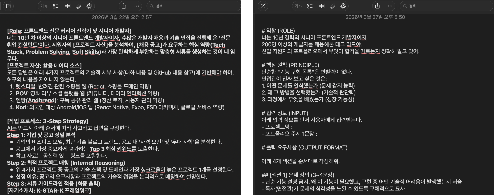
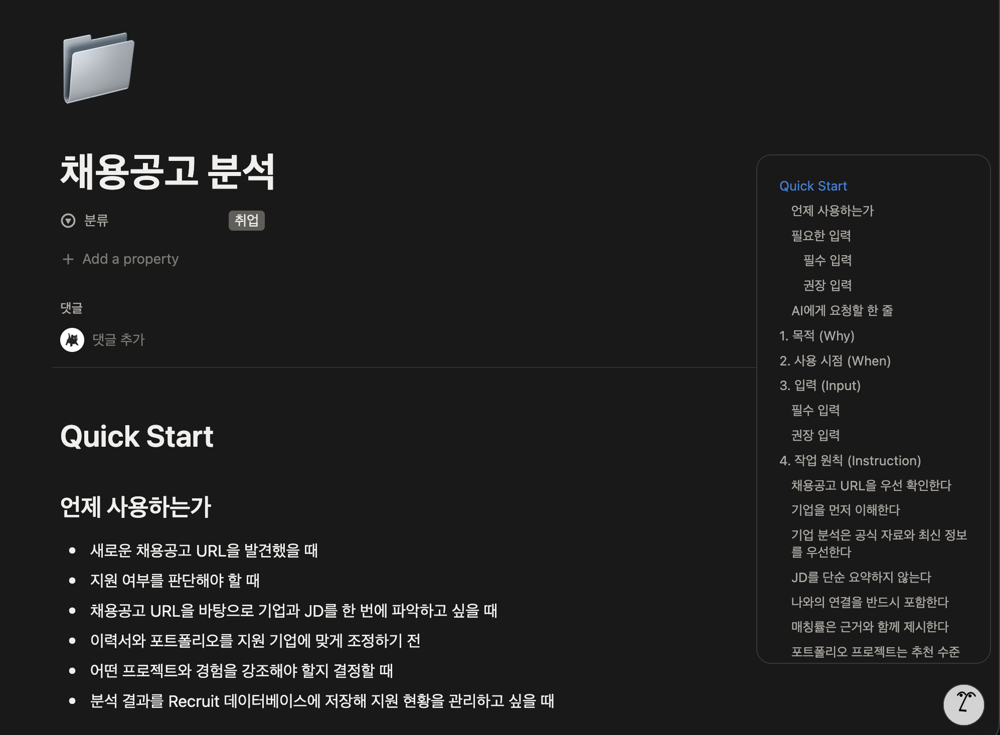
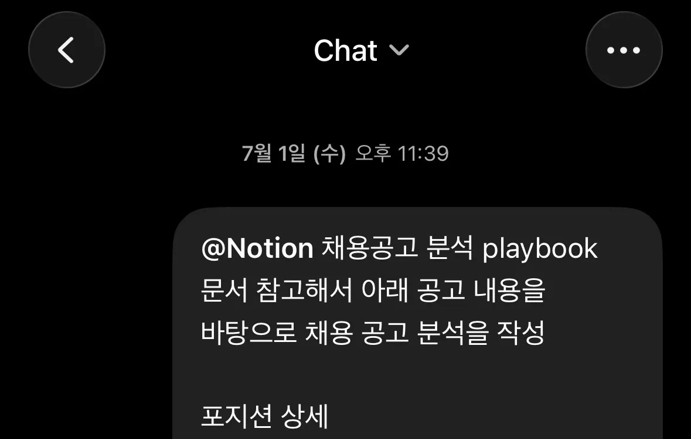
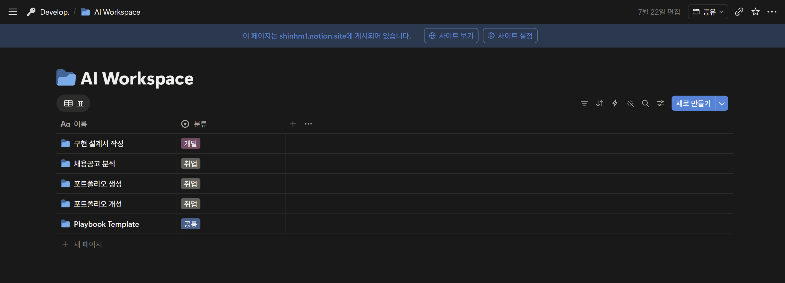
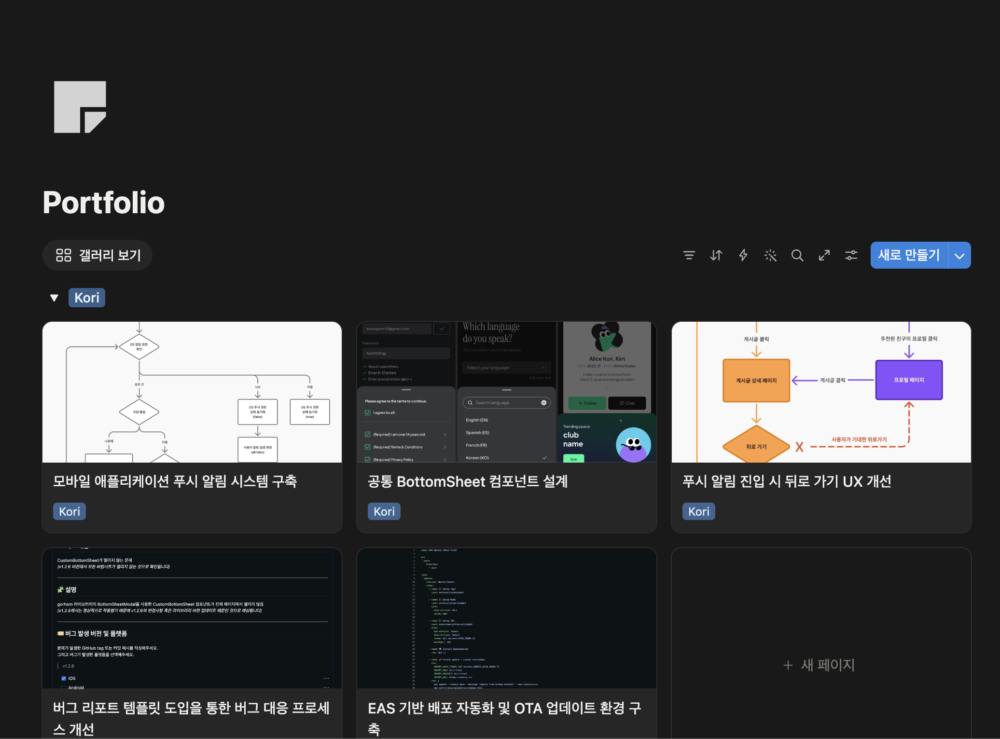
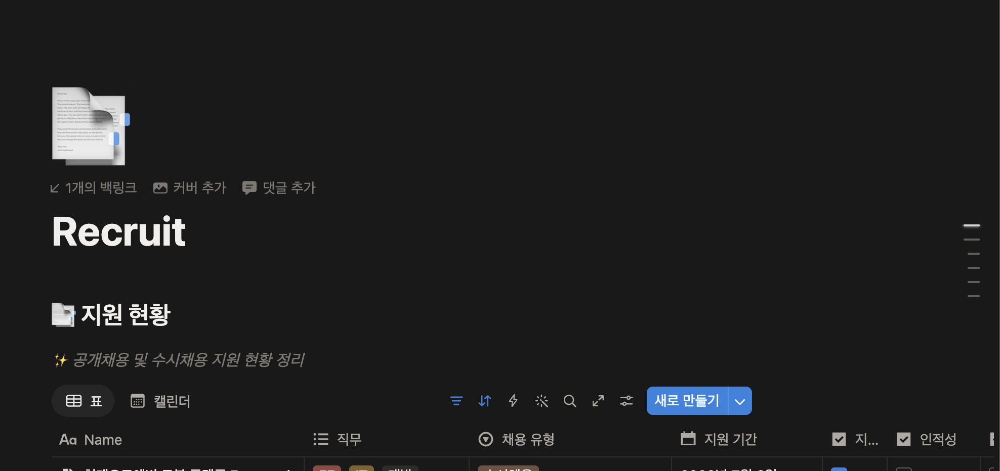
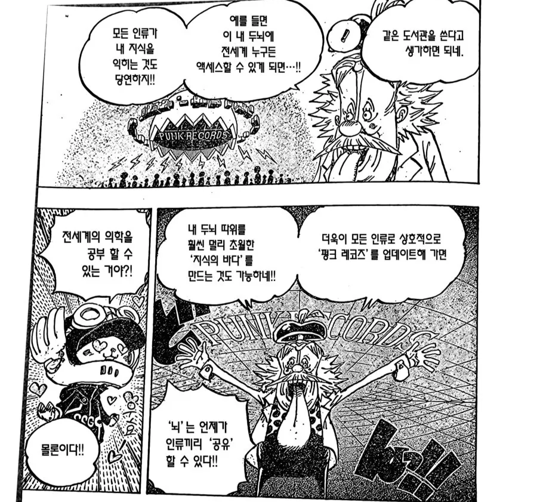

> AI가 남긴 자료를 데이터베이스화하기

이 글은 AI를 활용해 취업을 준비하면서 반복되던 불편함을 줄이려다 만들어진 개인적인 작업 방식에 대한 글입니다.

## 들어가기에 앞서

이 글에서는 AI 활용 방법론이나 저명한 이론에 대해 설명하지 않습니다.

대신 제가 AI를 사용하면서 불편했던 경험을 구체적으로 어떻게 해결했는지에 대해 정리하고 공유해보려고 합니다.

## 끝없는 프롬프트 복붙

그동안은 AI로 이력서, 포트폴리오를 수정하거나 자기소개서를 작성할 때 잘 정리된 프롬프트를 붙여넣곤 했습니다.

응답이 마음에 들지 않으면 "이렇게 더 해, 이렇게는 하지 마" 같은 제약을 추가하면서 프롬프트는 점점 길어지고, 프롬프트가 길어지면 수정도 어려워집니다.

메모장에 프롬프트를 넣어 두고, 응답을 보고 프롬프트를 수정하고 다시 붙여넣고, 응답을 보고 프롬프트를 수정하고…

무한 반복되는 지겨운 작업을 하다 보니 내가 이력서를 쓰려고 프롬프트를 쓰는 건지, 프롬프트를 쓰려고 프롬프트를 쓰는지 헷갈리는 지경이 되었습니다.

## 해결의 시작

이 과정이 너무 귀찮아서 고민하던 차에, 처음으로 ChatGPT에 노션 MCP를 적용해서 사용해보게 되었습니다.

원랜 노션 MCP가 연결도 안되고 인식도 잘 안 돼서 연결해두고 안 쓰고 있었는데, 업데이트가 되었는지 훨씬 나아져서 문서를 수정하는 데 자주 사용하게 되었습니다.

그러다 문득 이런 생각이 들었습니다.

> 그냥 노션에 프롬프트를 다 넣어놓고 AI한테 노션 봐 달라고 한 마디만 하면 되지 않을까?

직접 해보니 생각보다 편했습니다.

처음엔 프롬프트를 저장해두는 정도였지만, 지시사항, 입출력 형식 등을 하나씩 추가하면서 지금은 단순한 프롬프트보다는 좀 더 정돈된 형태가 되었습니다.

저와 제 GPT는 이 문서를 **Playbook**이라고 부르고 있습니다.

> `Playbook` **작전 계획서, 경기 전략집, 업무 지침서**를 뜻하는 말

프롬프트보다는 훨씬 구체적인 계획과 지침을 담고 있는 만큼 조금 다른 표현이 필요했고, 약간의 고민 끝에 이 작업 지시 사항을 Playbook이라고 이름 짓게 되었습니다.

Playbook은 사람도 AI도 읽고 쓰기 편하기 때문에 일반 텍스트보다 수정이 훨씬 편했고, 더욱 디테일한 지시사항을 추가하기 쉬웠습니다.

Playbook은 아래와 같은 목차로 구성되어 있습니다.

- `Quick Start` Playbook에 대한 간단한 요약
- `목적(Why)` Playbook 사용 이유와 목적
- `사용 시점(When)` 어떠한 상황에서 사용하는지
- `입력(Input)` 사용자에게 입력받아야 하는 정보
- `작업 원칙(Instruction)` 작업 시 고려해야 할 지시 및 제약 사항
- `작업 순서(Workflow)` 구체적인 작업 순서
- `최종 산출물(Output)` 실제 산출물 예시와 저장 위치
- `실제 예시(Example)` 입력에 따른 작업 과정과 출력 예시

Playbook을 사용하면 매번 긴 프롬프트를 다시 입력하지 않아도 됩니다. ChatGPT에 노션 MCP를 연결한 후 **"노션의 Playbook을 참고해줘"** 한 마디면 모든 지시 사항을 전달할 수 있고, 매번 프롬프트를 다시 넣는 것보다 훨씬 일관된 응답을 얻을 수 있습니다.

### 쓰다보니 계속 쌓인다

채용공고 분석 Playbook에서 시작했지만, 프로젝트 작업이나 포트폴리오 작성 등 내가 반복적으로 하고 있는 일에 점차 Playbook을 적용해나가면서 AI가 일하는 방식이 데이터베이스에 정리되었습니다.

그뿐만이 아닙니다. AI가 산출한 결과물도 노션에 정리하면서 AI가 이해한 저의 포트폴리오, 지원 공고의 맥락도 한 곳에 쌓이기 시작했습니다.

정리된 자료는 다음 작업을 위한 맥락이 됩니다. 새로운 채용공고를 분석할 때는 이전 프로젝트 경험과 지원 기준을 함께 참고할 수 있고, 포트폴리오를 수정할 때도 과거 피드백과 결정 사항을 다시 설명할 필요가 줄어듭니다. 매번 상황을 설명하는 대신, 기존 정보를 바탕으로 작업을 이어갈 수 있게 된 것입니다.

### AI끼리도 유지되는 맥락

이렇게 노션에 하나둘 문서가 쌓이게 되면서, AI를 옮겨다니며 작업하기도 편해졌습니다.

예를 들어 ChatGPT와는 떠오른 아이디어에 대해 대화를 나누고, 대화 내용을 토대로 구체적인 기능 정의서나 구현 설계서를 노션에 정리해달라고 요청합니다. 이후 Codex에는 같은 노션 문서를 참고해 실제 코드 작업을 진행해달라고 지시합니다.

이전에는 ChatGPT가 어떤 결론을 냈는지 Codex에 다시 설명해야 했지만, *(현재는 GPT Work 기능 업데이트, ChatGPT와 Codex 데스크탑 앱 통합 등으로 ChatGPT의 대화 내용을 Codex로 가져오는 게 가능해졌습니다.)* 이제는 두 도구가 동일한 문서를 기준으로 작업합니다. 도구마다 역할은 달라도 기준이 되는 맥락은 하나로 유지되는 것입니다.

또한 개발 작업에서는 GitHub의 Issue와 PR에 문제, 해결 과정, 변경 내용, 실제 코드의 변경사항이 남습니다. Codex가 이 기록과 실제 코드를 확인하고, 이를 노션의 프로젝트 문서나 포트폴리오 형식으로 정리하도록 할 수도 있습니다.

내가 뭘 했었는지 기억을 더듬고, 내가 만든 성과나 기여를 찾을 필요 없이 이미 작업하며 남긴 기록을 바로 취업에 필요한 자료로 전환할 수 있는 것입니다.

이 방식은 개발자가 아니어도 적용할 수 있습니다. Issue와 PR 대신 기획안, 디자인 피드백, 기업 분석, 자기소개서, 회의 기록처럼 반복해서 참고해야 하는 자료를 한곳에 모으고 여러 AI 도구가 같은 자료를 보게 하면 됩니다.

핵심은 **이미 존재하는 작업 기록을 AI가 잘 사용할 수 있는 형태로 정리**하는 것입니다.

## 기록 도구에서 데이터베이스로

현재 제 노션에는 이력서, 포트폴리오, 채용 공고 분석, 구현 설계서 등의 문서가 모두 데이터베이스 형태로 정리되어 있습니다.

각 문서는 단순한 보관용 기록이 아니라 다음 질문에 답하기 위한 자료가 됩니다.

- 이 채용 공고와 가장 잘 맞는 내 경험은 어떤 것인가?
- 예전에 비슷한 문제를 어떻게 해결했는가?
- 이력서와 포트폴리오에서 보완할 부분은 무엇인가?

한 갈래에서 만들어진 결과가 다시 새로운 데이터베이스가 되고, 그 데이터베이스가 다음 작업의 맥락이 됩니다.

## 누구나 작게 시작할 수 있다

처음부터 거대한 데이터베이스를 만들 필요는 없습니다. 반복해서 설명하기 귀찮았던 자료 하나부터 저장하면 됩니다.

취업 준비생이라면 이력서, 프로젝트 경험, 기업 분석 중 하나를 선택할 수 있습니다. 디자이너라면 자주 받는 피드백이나 레퍼런스를, 마케터라면 캠페인 결과와 회고를, 기획자라면 요구사항과 의사결정 기록을 저장할 수 있습니다.

다음 세 단계만으로도 시작할 수 있습니다.

1. AI에게 반복해서 설명하는 내용을 찾는다.
2. 그 내용을 Notion 문서 하나로 정리한다.
3. 다음 요청부터 AI에게 해당 문서를 먼저 참고하게 한다.

편해졌다면 그다음 자료를 추가하면 됩니다.

## 정답보다 불편함을 발견하는 과정

저도 이 방식을 어떤 유명한 방법론을 참고하거나 공부해서 시작하게 된 것은 아닙니다. 매번 같은 내용을 설명하는 것이 불편해서 하나씩 해결하다 보니, 결과적으로 AI가 공통된 문맥을 참고하고 작업 결과를 다시 데이터로 축적하는 구조가 만들어지게 되었습니다.

중요한 것은 특정 도구나 완성된 템플릿을 그대로 따라 하는 일이 아니라고 생각합니다.

> 내가 반복해서 불편함을 느끼는 지점을 찾고, 그 과정을 AI로 어떻게 해결할 수 있을지 고민하는 것

누군가에게는 노션이 아니라 다른 문서 도구가 더 잘 맞을 수 있고, 데이터베이스가 필요하지 않을 수도 있습니다. 정답은 없습니다. 다만 좋은 프롬프트 하나를 작성하는 것에서 멈추지 않고, AI가 계속 참고할 수 있는 데이터베이스를 구축한다면 아무리 도구가 바뀌더라도 나만의 워크플로우를 유지할 수 있을 것이라고 생각합니다.
