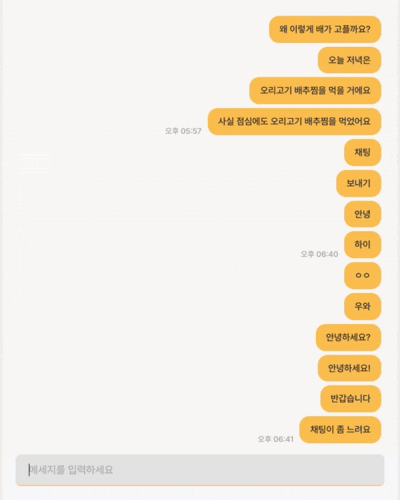
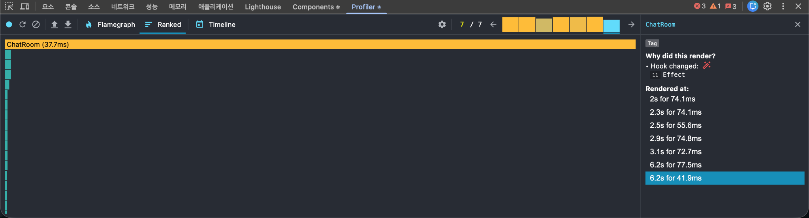
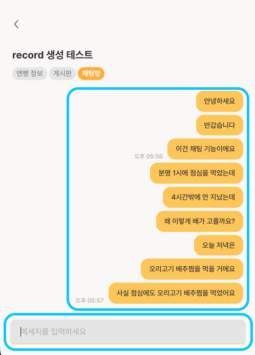
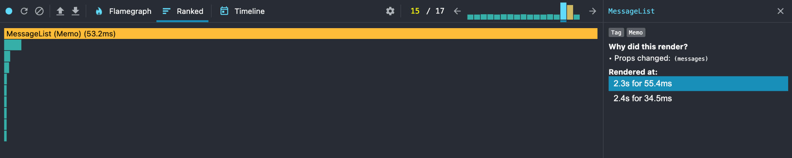
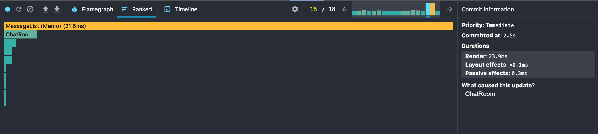

이 글은 현재 제가 운영 중인 서비스, [엔빵](https://www.nbread.co.kr/)의 채팅방 렌더링 성능을 개선한 과정과 그 결과에 대해 작성한 글입니다.

# 💬 채팅이 너무 느리다

엔빵에는 그룹원들끼리 간단한 대화나 정산 공지를 나눌 수 있는 채팅방이 존재합니다.

Supabase Realtime을 활용해 구현한 간단한 채팅 기능으로, 데이터베이스의 변화를 구독하고 실시간으로 수신해 메시지를 보여주는 방식으로 구현되어 있습니다.

채팅을 구현하며 테스트용 그룹을 개설하고 테스트 메시지를 100개 정도 주고받았을 때쯤, **채팅이 굉장히 느리게 보내진다는 걸** 알게 되었습니다.



Gif는 실제 화면과 달라 약간의 차이가 있을 수 있지만, 체감상 거의 3\~4초 정도의 딜레이를 느낄 수 있었습니다.

실시간으로 대화를 주고받는 채팅 서비스에서 3초의 지연은 결코 무시할 수 없습니다. 심지어 제가 테스트를 하는 도중에도 답답함이 느껴질 정도였습니다.

따라서 빠르게 개선 작업을 진행하게 되었습니다.

# 🔍 React DevTools로 딜레이 측정하기

정확한 원인과 지연 정도를 파악하기 위해 **React Developer Tools**를 활용했습니다.

React Developer Tools는 React로 빌드된 웹 사이트를 디버깅할 수 있는 브라우저 확장 프로그램입니다. DevTools의 Profiler 기능을 사용하면 아래와 같은 작업이 가능합니다.

- 컴포넌트 렌더링 시간 측정
- 어떤 컴포넌트가 렌더링되었는지 확인
- 렌더링 성능 병목 지점 분석
- 불필요한 리렌더링 식별

이를 통해 채팅을 보낼 때마다 어떤 컴포넌트에서 어느 정도의 렌더링 시간이 걸리고 있는지 정확하게 측정할 수 있었습니다.



채팅을 1개 보낼 때 발생하는 렌더링을 측정한 결과입니다.

메시지 1개를 전송하는 과정에서 총 7개의 Commit이 발생한 것을 확인할 수 있었습니다. 여기서 Commit이란 React가 렌더링 결과를 실제 DOM에 반영하는 단계를 말합니다.

모든 Commit에서 `ChatRoom` 컴포넌트가 렌더링 비용의 대부분을 차지하고 있었고, 각 Commit은 **41.9ms \~ 77.5ms** 정도 소요되고 있었습니다. 단순히 새로운 메시지 하나가 추가되는 작업임에도 채팅방 전체가 높은 비용으로 반복적으로 렌더링 되면서 지연이 발생한 것이었습니다.

# 원인 파악하고 개선하기

구체적인 원인을 파악하기 위해 `ChatRoom` 코드를 확인해 보았습니다.

```tsx
const ChatRoom = () => {
  const [inputText, setInputText] = useState('');
  const [chatMessages, setChatMessages] = useState<ChatMessage[]>([]);
  const [scrollState, setScrollState] = useState(false);

  const sendChatMessages = async (content: string) => {
    await insertChatMessage(user!, nbreadId, content);
    setScrollState(true);
  };

  useEffect(() => {
    if (scrollState) {
      scrollToBottom();
      setScrollState(false);
    }
  }, [chatMessages]);

  const isLastInMinuteGroup = (index: number) => {
    const current = chatMessages[index];
    const next = chatMessages[index + 1];

    return next?.userId !== current.userId;
  };

  return (
    <>
      {chatMessages.map((message, index) => (
        <div key={index}>
          {message.content}
          {isLastInMinuteGroup(index) && <span>{message.createdAt}</span>}
        </div>
      ))}

      <input value={inputText} onChange={event => setInputText(event.target.value)} />
    </>
  );
};
```

기존 코드는 메시지 입력 상태, 메시지 목록 상태, 스크롤 상태, 메시지 수신 시간 계산 등 채팅에 관련된 모든 책임이 전부 `ChatRoom` 컴포넌트에 집중되어 있어, 메시지 상태가 변경될 때마다 `ChatRoom` 전체가 높은 비용으로 다시 렌더링 되고 있었습니다. 이렇게 렌더링 비용이 높아지면 `ChatRoom`이 한번 렌더링될 때 더 많은 시간이 소요되고, 결과적으로 채팅의 속도가 지연됩니다.

이러한 문제를 해결하기 위해 아래 3단계의 해결 과정을 거쳤습니다.

## 1️⃣ 메시지 렌더링 책임 분리

먼저 메시지 렌더링의 책임을 분리했습니다.

`ChatRoom`에는 크게 두 개의 다른 컴포넌트가 존재합니다.



- 메시지 리스트
- 채팅을 입력하는 `Input`

기존에는 새로 메시지를 입력할 때마다 `ChatRoom` 전체가 렌더링 되고 있었기 때문에, `Input`도 불필요하게 함께 렌더링 되고 있었습니다.

따라서 이를 방지하기 위해 `MessageList` 컴포넌트를 구현하고, 페이지 내에 있던 `messages.map`을 `MessageList`로 분리했습니다.

```typescript
<MessageList messages={chatMessages} currentUserId={user?.id} />
```

```typescript
{messages.map((message, index) => {
  const previous = messages[index - 1]
  const next = messages[index + 1]

  const showTime =
    !next ||
    next.userId !== message.userId ||
    next.formattedTime !== message.formattedTime

  return (
    <>
      {chatMessages.map((message, index) => (
        <div key={index}>
          {message.content}
          {isLastInMinuteGroup(index) && <span>{message.createdAt}</span>}
        </div>
      ))}
    </>
  )
})}
```

여기서 메시지의 모임인 `MessageList`도 **개별 메시지 단위로 분리**할 수 있습니다. 따라서 `MessageItem` 컴포넌트를 구현한 후, `message.map`에서 `MessageItem`을 return하도록 수정했습니다.

```typescript
const MessageItem = ({
  content,
  formattedTime,
  isMine,
  showSender,
  showTime,
  status,
  userName,
  userProfileImage,
}: MessageItemProps) => {
  // ...
};

export default MessageItem;
```

```typescript
{messages.map((message, index) => {
  // ...
  return <MessageItem {...props} />
})}
```

이렇게 메시지 리스트의 렌더링은 `MessageList`로, 개별 메시지의 렌더링은 `MessageItem`으로 책임을 분리했습니다.

## 2️⃣ MessageItem에 React.memo 적용

메시지가 추가될 때 기존 메시지 아이템까지 불필요하게 다시 렌더링 되는 것을 막기 위해 `MessageItem`에 메모이제이션을 적용했습니다.

```typescript
export default memo(MessageItem);
```

[memo를 사용하면 컴포넌트의 Props가 변경되지 않은 경우 리렌더링을 건너뛸 수 있습니다.](https://ko.react.dev/reference/react/memo) 따라서 새 메시지가 추가되더라도 기존 메시지 아이템은 렌더링 되지 않아 렌더링 비용을 줄일 수 있습니다.

2단계까지 진행한 후, 채팅을 1개 발송할 때의 성능을 다시 측정해 보았습니다.



한번의 Commit 당 40\~60ms가 측정됐던 기존과는 달리, 1\~2개의 Commit을 제외하고는 렌더링 시간이 1\~2ms로 줄어든 것을 확인할 수 있었습니다.

문제는 남은 1\~2개의 Commit인데, 아직도 53.2ms로 메시지 1개가 추가되는 작업이라는 점을 고려해도 여전히 높은 비용을 보이고 있었습니다.

컴포넌트의 렌더링 원인이었던 `messages` props를 확인해봤습니다.

```typescript
const MessageList = ({ messages, currentUserId }: MessageListProps) => {
  const messageItems = useMemo(
    () =>
      messages.map((message) => ({
        ...message,
        formattedTime: formatMessageTime(message.createdAt),
      })),
    [messages],
  )

  return messageItems.map((message) => (
    <MessageItem key={message.id} {...message} />
  ))
}
```

문제는 새로운 메시지가 추가될 때마다 `MessageList` 내부의 `messages.map()`이 다시 실행된다는 점이었습니다.

`messages`가 변경되면 `useMemo`가 다시 실행되고, 이 과정에서 전체 메시지 배열을 순회하게 됩니다. 즉, 메시지 하나가 추가되더라도 새 메시지만 처리하는 것이 아니라 기존 메시지 전체를 다시 순회하면서 추가적인 비용이 발생합니다.

남은 렌더링 비용은 이 순회 과정에서 수행되는 `formatMessageTime`과 관련이 있었습니다. 그래서 다음 단계에서는 `formatMessageTime()`을 렌더링 과정에서 분리했습니다.

## 3️⃣ 시간 포맷팅을 메시지 생성 시점으로 이동

`formatMessageTime`은 메시지 생성 시간을 채팅 UI에 표시하기 위한 문자열로 변환하는 함수입니다. 이 함수는 `createdAt` 값을 `Date` 객체로 변환한 뒤, `toLocaleString()`을 통해 사용자가 읽을 수 있는 시간 형식(ex. 오전 09:30)으로 포맷팅합니다.

```typescript
const formatMessageTime = (createdAt: string) =>
  new Date(createdAt).toLocaleString('ko-KR', {
    timeZone: 'Asia/Seoul',
    hour: '2-digit',
    minute: '2-digit',
  });

const formattedTime = formatMessageTime(message.createdAt);
const nextFormattedTime = next ? formatMessageTime(next.createdAt) : null;
```

문제는 이 연산이 렌더링 과정에서 반복적으로 수행되고 있었다는 점입니다. `new Date()`는 문자열을 파싱해 새로운 `Date` 객체를 생성하고, `toLocaleString()`은 로케일과 타임존 정보를 기반으로 날짜를 포맷팅합니다.

만약 메시지가 100개라면 렌더링 한 번에 최소 100번 이상의 날짜 포맷팅이 발생하고, 다음 메시지의 시간과 비교하기 위해 추가 호출까지 수행됩니다.

하지만 메시지의 생성 시간은 한 번 생성되면 변경되지 않는 데이터입니다. 따라서 렌더링이 발생할 때마다 시간을 다시 계산할 필요가 없으며, **메시지를 생성하거나 수신하는 시점에 한 번만 계산해 저장**하는 것이 더 효율적입니다.

```typescript
export const formatChatMessageTime = (createdAt: string) =>
  new Date(createdAt).toLocaleString('ko-KR', {
    timeZone: 'Asia/Seoul',
    hour: '2-digit',
    minute: '2-digit',
  });
```

```typescript
const chatMessages: ChatMessage[] = data.map(item => ({
  id: item.id,
  content: item.content,
  nbreadId: item.nbread_id,
  userId: item.user_id ?? '',
  userName: item.user_name,
  userProfileImage: item.user_profile_image,
  createdAt: item.created_at,
  formattedTime: formatChatMessageTime(item.created_at),
}));
```

메시지를 DB에서 가져오는 시점에 `formattedTime`을 미리 계산하도록 변경했습니다. 이 변경으로 렌더링 중 시간 포맷 계산 비용을 제거할 수 있었습니다.

# ✨ 성능 개선 결과

3단계까지 진행한 후 다시 성능을 측정해 보았습니다.



기존에는 메시지 1개를 전송할 때마다 `ChatRoom` 전체가 반복적으로 렌더링 되었고, 각 Commit마다 40\~60ms 수준의 렌더링 비용이 발생하고 있었습니다. 개선 후에는 대부분의 Commit이 1\~2ms 수준으로 줄어들었고, 마지막 병목이었던 `MessageList`의 렌더링 시간도 **53.2ms에서 21.6ms**로 **약 60% 감소**한 것을 확인할 수 있었습니다.

개선 전에는 메시지 하나를 보낼 때 입력, 메시지 목록, 스크롤, 시간 계산 로직이 함께 실행되며 채팅방 전체가 영향을 받았습니다. 개선 후에는 메시지가 추가되더라도 실제로 변경이 필요한 메시지 목록 중심으로 렌더링 범위가 좁아졌고, 기존 메시지에 대한 반복 계산도 줄어들었습니다.

특히 컴포넌트를 분리하는 것에 그치지 않고, 렌더링 시점에 반복 계산되던 시간 포맷팅 로직까지 분리하면서 메시지 추가 시 발생하는 불필요한 연산을 줄일 수 있었습니다.

그 결과 실제 사용 시에도 메시지 전송 후 화면이 갱신되는 속도가 더 빠르게 느껴졌고, 채팅방이 이전보다 가볍게 동작하는 것을 확인할 수 있었습니다.

# 회고 및 추후 개선 방향

React DevTools를 사용해서 렌더링 속도를 직접 측정해 본 건 처음이었는데, 화면을 직접 녹화하고 그 과정에서 어떤 컴포넌트가 얼마나 빠르게 렌더링 되는지, 렌더링 원인은 무엇인지를 바로 보여줘서 굉장히 편리했습니다.

처음엔 '컴포넌트 분리 정도만 하면 되지 않을까?' 하는 생각으로 시작한 작업이었는데, 렌더링 과정에서 수행되는 작은 연산들이 반복되면 예상보다 큰 병목이 될 수 있다는 점을 느꼈습니다.

이번 작업을 통해 채팅방의 렌더링 성능을 대폭 개선했지만, 채팅방에 메시지가 쌓이면 쌓일수록 어쩔 수 없이 렌더링 비용이 증가하게 됩니다. 이런 경우, 메시지 리스트 중 화면에 실제로 보이는 영역의 요소만 렌더링 **가상화**를 적용해 렌더링 병목을 해소할 수 있습니다.

서비스 운영 기간이 길어지고 유저들이 나눈 메시지가 쌓이게 된다면 추후에 가상화까지 적용해보면 좋을 것 같습니다. 🙂
