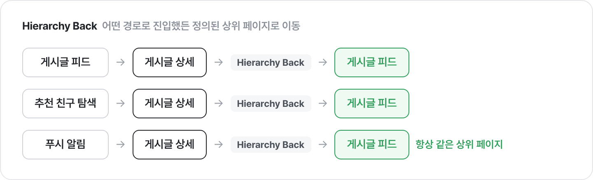
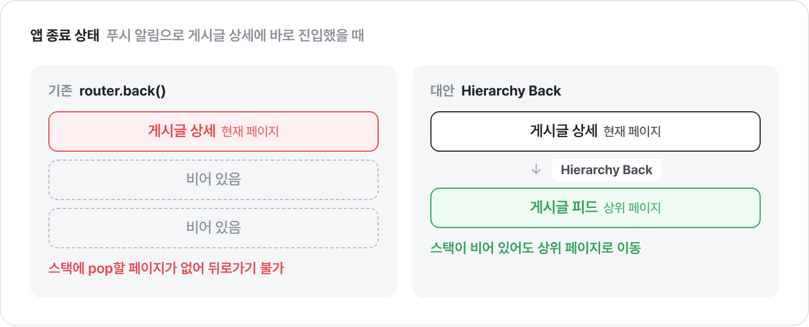
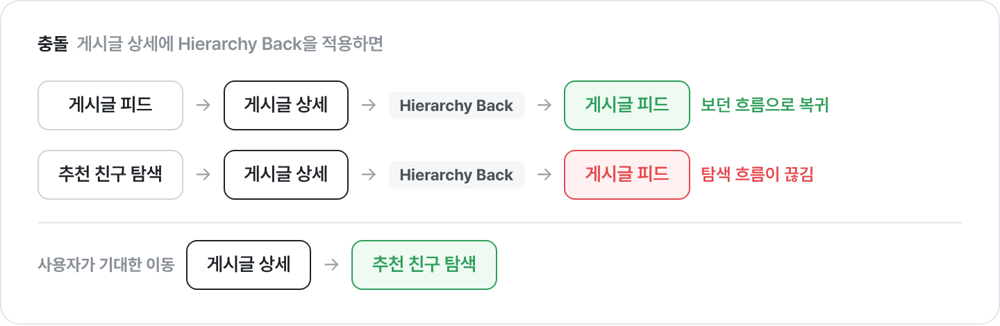

이 글은 푸시 알림으로 앱에 진입했을 때 뒤로 가기가 동작하지 않던 문제를 해결한 과정에 대한 글입니다. 더 간단한 해결책도 있었지만, 서비스가 이미 지키고 있던 뒤로 가기의 기준을 유지하기 위해 내비게이션 스택을 직접 구성하는 방법을 선택했습니다. 이러한 선택에 이르기까지의 고민을 함께 정리해 보려고 합니다.

# 푸시 알림으로 앱을 켜면 뒤로 가기가 불가능한 문제

Expo로 개발한 애플리케이션에 푸시 알림을 도입한 지 얼마 안 됐을 때였습니다. 푸시 알림을 테스트하던 중, 게시글 알림을 클릭해서 게시글 상세 페이지로 이동하면 **뒤로 가기가 불가능한 문제**를 발견하게 되었습니다.

## 앱 상태에 따라 다르게 동작한 뒤로 가기

앱이 켜져 있거나 백그라운드 상태일 때는 푸시 알림을 눌러 게시글 상세 페이지에 진입해도 뒤로 가기가 정상적으로 동작했습니다.

하지만 앱이 완전히 종료된 상태에서 푸시 알림을 눌러 상세 페이지에 진입하면 뒤로 가기가 동작하지 않았습니다. 헤더의 뒤로 가기 버튼도, 뒤로 가기 스와이프 동작도 동작하지 않아 마치 상세 페이지에 갇힌 상태처럼 느껴졌습니다.

결국 앱을 사용하려면 어쩔 수 없이 앱을 강제로 종료하고 다시 실행해야 했습니다.

## Expo Router와 router.back()

당시 상세 페이지들은 모두 뒤로 가기에 router.back()을 사용하고 있었습니다.

> `router.back()` Expo Router에서 이전 페이지로 돌아가는 함수

router.back()은 Expo Router에서 이전 페이지로 돌아가는 함수로, 페이지 이동 내역이 쌓여 있는 내비게이션 스택에서 현재 화면을 꺼내 이전 화면으로 돌아가는 역할을 합니다.

일반적인 페이지 이동에서는 이 스택이 유지되기 때문에 큰 문제가 없었습니다. 하지만 앱 종료 상태에서 푸시 알림을 클릭하면 다른 페이지들이 스택에 쌓이지 않은 채로 우선 상세 페이지로 이동해버리기 때문에 스택에 상세 페이지 하나만 쌓이게 됩니다.

`router.back()`을 호출해도 돌아갈 이전 페이지가 없기 때문에 뒤로 가기가 동작하지 않았던 것이었습니다.

# 뒤로 가기를 처리하는 두 가지 방식

해결 과정을 구체적으로 설명하기 전에, UX적으로 고려할 수 있는 뒤로 가기의 두 가지 방식을 소개해보려고 합니다.

## History Back


History Back은 사용자가 실제로 지나온 경로의 직전 페이지로 돌아가는 방식입니다.

예를 들어 사용자가 홈에서 게시글 피드로 이동했다면, 뒤로 가기를 눌렀을 때 실제로 직전에 방문했던 홈 페이지로 돌아갑니다. 브라우저의 뒤로 가기가 바로 이런 방식을 사용하고 있습니다.

## Hierarchy Back


Hierarchy Back은 사용자의 방문 이력과 관계없이 현재 페이지의 route 상 부모 페이지로 이동하는 방식입니다.

예를 들어 게시글 상세 페이지의 상위 페이지를 게시글 피드로 정의해 두면, 사용자가 어떤 경로로 게시글 상세 페이지에 진입하든 뒤로 가기를 눌렀을 때 게시글 피드로 이동하게 됩니다.

# 어떤 뒤로 가기를 선택해야 할까?



사실 문제만 놓고 보면 Hierarchy Back으로 쉽게 해결할 수 있었습니다. 상세 페이지의 뒤로 가기 버튼이 항상 피드로 이동하도록 바꾸면, 스택이 비어 있든 아니든 사용자는 늘 같은 곳으로 돌아갈 수 있기 때문입니다.

```tsx
// DetailHeader.tsx
  return (
    <Header>
        <!-- 기존 뒤로 가기 -->
        <!-- <BackBtn onPress={() => router.back()}/> --> 

        <!-- Hierarchy Back을 적용한 뒤로 가기 -->
        <BackBtn onPress={() => router.replace('/(tab)/community')}/>
        /* ... */
    </Header>
  );
```

위 코드 예시처럼, `router.back()`을 `router.replace()`로 변경하고 인자로 부모 페이지의 라우트를 넣기만 하면 Hierarchy Back 방식을 활용해 문제를 해결할 수 있습니다.

하지만, 이 방식은 기존 서비스의 뒤로 가기 방식과 충돌한다는 한계가 존재합니다.

## 기존 뒤로 가기와의 충돌

당시 서비스에는 게시글 상세 페이지로 진입하는 경로가 여러 개 존재했습니다.



여기에 Hierarchy Back을 적용하면, 추천 친구를 둘러보다 게시글에 들어간 사용자도 뒤로 가기를 누르는 순간 게시글 피드로 이동하게 됩니다. 추천 친구를 보고 있었는데 엉뚱한 게시글 피드로 이동하면서 기존 탐색 흐름이 끊기게 됩니다. 서비스 전체가 History Back으로 동작하는 상황에서 일부 페이지만 기준이 달라지면, 사용자는 뒤로 가기 버튼을 눌러도 어디로 갈지 예측하기 어려워집니다.

따라서 저는 뒤로 가기 버튼의 동작 방식을 바꾸지 않고, 대신 **뒤로 갈 수 있는 상태를 만들어주기로** 했습니다.

# 내비게이션 스택을 미리 구성하기

## initialRouteName 설정하기

먼저 커뮤니티 탭의 가장 초기 페이지인 게시글 피드 페이지에 `initialRouteName`을 지정했습니다. `initialRouteName`은 Expo Router에서 내비게이터가 처음 렌더링될 때 가장 먼저 보여줄 초기 경로를 지정하는 속성입니다.

```typescript
export const unstable_settings = {
  initialRouteName: '/(tabs)/community',
};
```
이렇게 하면 알림으로 상세 페이지에 진입해도 스택 아래에 항상 커뮤니티 탭의 초기 페이지가 쌓이게 됩니다. 하지만 `initialRouteName`은 스택의 첫 페이지 하나만 지정해 줄 뿐, 중간 경로의 페이지들은 스택에 쌓아 주지 않습니다. 상세 페이지처럼 여러 경로를 거쳐야 하는 경우 추가적인 이동이 필요했습니다.

> ⚠️ [`initialRouteName`은 Expo 58부터 `anchor`로 대체되었습니다.](https://docs.expo.dev/router/advanced/router-settings/#anchor) 당시 프로젝트는 Expo 53을 사용하고 있었기 때문에 `initialRouteName`을 적용했습니다. Expo의 버전에 따라 해결 방법이 달라질 수 있습니다.

## 부족한 스택은 직접 push하기

그래서 부족한 depth의 페이지는 진입 시점에 직접 push하는 방식으로 스택을 미리 구성했습니다.

```typescript
export function notificationRouterReplace(notification) {
  const targetRoute = String(TARGET_ROUTER[data.type as string]);
  
  switch (notification.type) { 
	  // ...
    case 'followuserpost':                      // 팔로우한 유저의 게시글 알림인 경우
      setTimeout(() => {
        router.push({
          pathname: `/(tabs)/community/[id]`,   // 게시글 상세 페이지를 스택에 push
        });
      }, 500);
    }
  }
```

`notificationRouteReplace` 함수는 푸시 알림을 눌러 앱에 진입했을 때 알림의 종류에 따라 중간 경로를 push하는 함수입니다. 알림 타입이 `followuserpost`, 즉 팔로우한 유저의 새 게시글 알림인 경우 게시글 상세 페이지 경로를 `router.push()`로 스택에 추가합니다.

## setTimeout을 적용한 이유

앱이 완전히 종료된 상태에서 푸시 알림을 눌러 앱이 Cold Start되면 Expo Router의 루트 레이아웃과 내비게이션 컨테이너가 아직 마운트되기 전에 코드가 실행될 수 있습니다. 이 시점에 `router.push()`를 바로 호출하면 푸시가 무시되거나 에러가 발생합니다.

그래서 500ms 정도의 지연을 줘서 내비게이션 컨테이너가 완전히 초기화될 시간을 확보한 뒤에 푸시를 호출하도록 우회했습니다. 

> 다만 이 방식은 기기 성능이나 초기화 속도에 따라 타이밍이 어긋날 수 있어 근본적인 해결책이 아닙니다. 만약 지금 다시 구현한다면 기기 성능이나 네트워크 속도에 따라 페이지가 로딩되는 시간을 측정한 후 지연 시간을 변경하거나, 내비게이션 컨테이너의 준비 상태를 직접 확인하는 방법을 찾아 적용할 것 같습니다.

위와 같은 해결 과정을 통해 푸시 알림으로 상세 페이지에 진입한 경우에도 뒤로 가기가 가능해졌습니다. 또한 상세 페이지 내부의 `router.back()`은 그대로 유지했기 때문에 기존 뒤로 가기 방식과 충돌하지 않고, 탐색 맥락을 유지하면서 문제를 해결할 수 있었습니다.

# 회고

처음에는 상세 페이지에서 뒤로 가기가 불가능한 문제에서 출발했지만, 해결하다 보니 뒤로 가기를 어떤 식으로 설계해야 할지까지 고려해 볼 수 있었습니다.

뒤로 가기는 그저 이전 화면으로 돌아가는 기능이라고만 생각했었는데, 자료를 찾아보며 History Back과 Hierarchy Back이라는 서로 다른 뒤로 가기의 기준이 있다는 것을 알게 되었습니다. '간단한 기능 하나를 구현하면서도 UX적으로 이렇게까지 고민해 볼 수 있구나' 하는 생각도 들었습니다. 이 경험 덕에 이후 서비스를 개발하면서 UX적으로 이게 맞을까? 한 번 더 고민해 보는 습관도 갖게 되었습니다. 🐸

### 참고 자료

문제 해결 당시 참고했던 자료입니다.

- [뒤로 가기는 어디로 가야하는가](https://brunch.co.kr/@uxdesingercho/1)
- [Principles of navigation](https://developer.android.com/guide/navigation/principles?hl=ko)