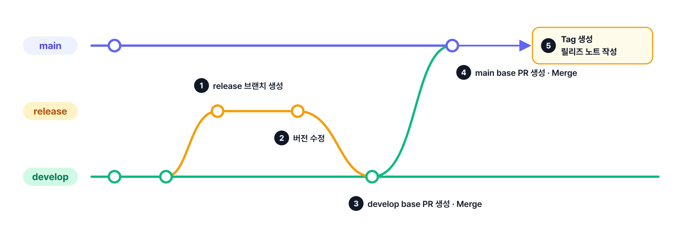
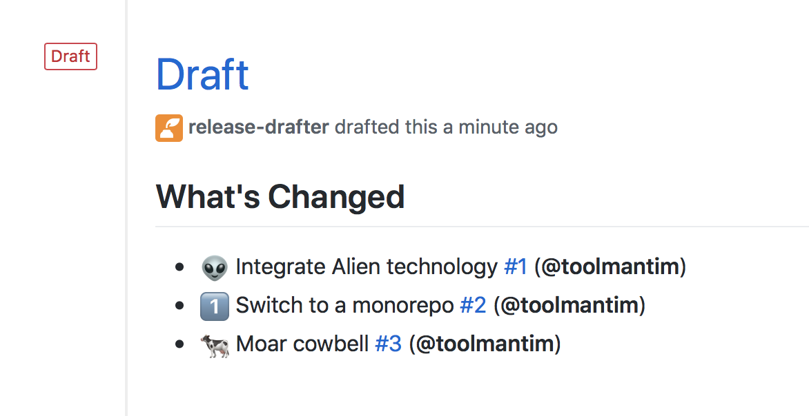
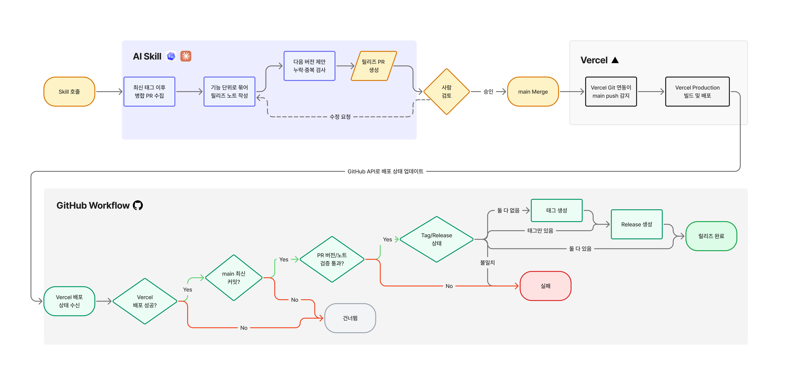
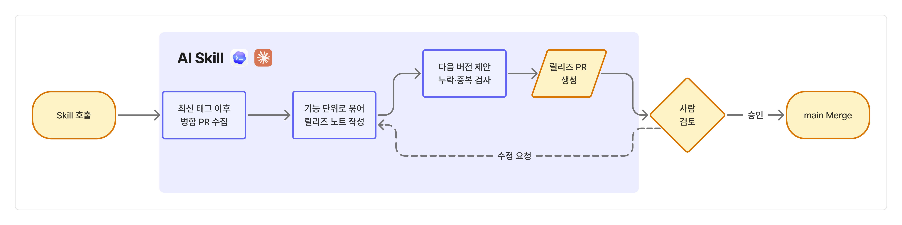
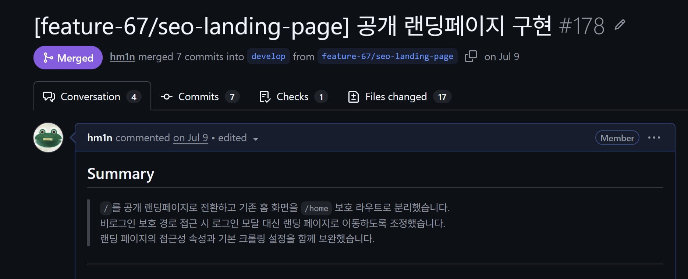
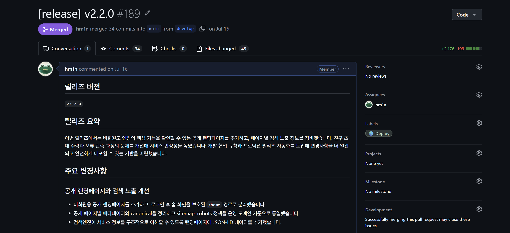
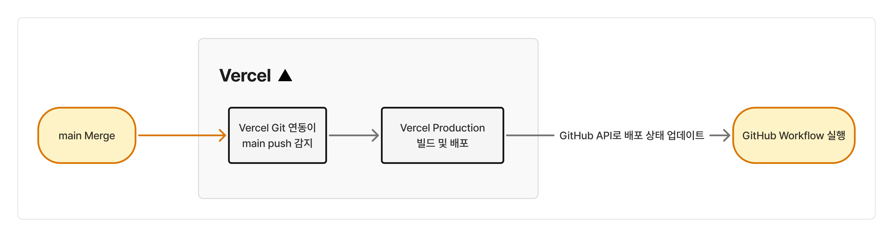
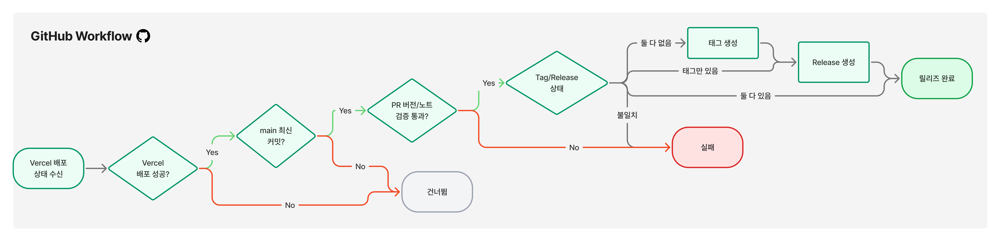
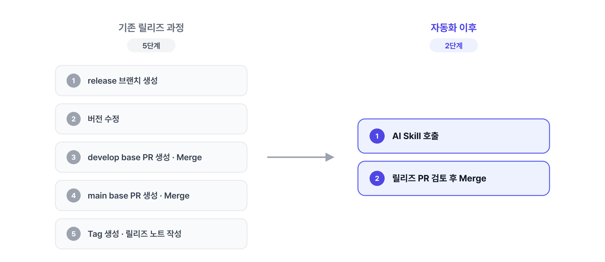
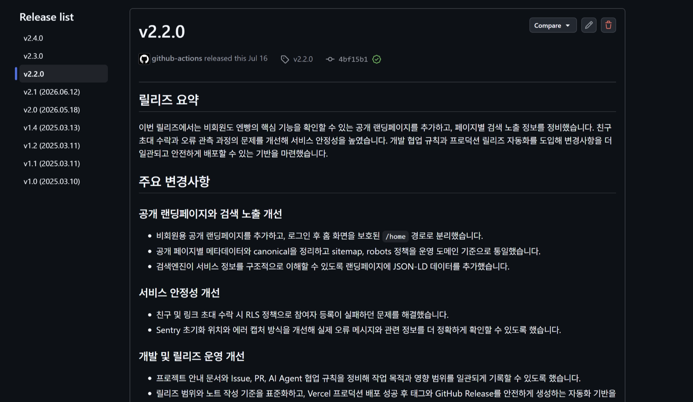

이 글은 현재 운영 중인 개인 프로젝트의 릴리즈 과정을 AI Skill과 GitHub Actions로 자동화한 과정을 정리한 글입니다. AI를 활용해 릴리즈 노트를 작성하고, Workflow로 Tag와 Release를 자동으로 생성해 번거롭던 릴리즈 과정을 자동화한 과정에 대해 정리해보려고 합니다.

# 번거롭던 기존 릴리즈 과정

해당 프로젝트는 main 브랜치에 변경 사항이 반영되면 Vercel이 자동으로 Production 배포를 진행하도록 설정되어 있었습니다. 배포 자체는 자동이었지만, 그 전후의 릴리즈 과정을 직접 진행하면서 번거로움을 느꼈습니다.



먼저 릴리즈를 위한 브랜치를 생성합니다. 여기서 package.json의 버전을 수정하고 빌드 오류가 있는지 점검합니다. 이후 변경사항을 develop에 반영하는 PR을 생성하고 Merge한 후, develop을 main에 반영하는 PR도 생성하고 Merge합니다. main에 Merge되면 Vercel이 배포를 진행하고, 저는 그동안 직접 Tag와 Release를 작성합니다. (아이고 숨차…)

이 과정을 릴리즈할 때마다 매번 똑같이 반복하는 게 너무 번거로웠습니다. 특히 릴리즈 노트를 쓸 때에는 이전 릴리즈 이후 병합된 PR을 직접 찾아서 하나씩 정리하곤 했는데, 이 과정에 많은 시간을 소요하곤 했습니다. 특정 PR을 누락해 릴리즈 노트 내용에서 빠지거나 버전을 잘못 작성하기도 하는 실수가 종종 생겼습니다.

이렇게 반복되는 작업에 많은 시간이 소요되고 실수가 발생하기 시작하면서 '이 과정을 자동화해볼 순 없을까?' 하는 생각이 들었습니다.

# 어떻게 자동화해야 할까?

### Release Drafter로 PR을 분류하기

먼저 다른 사람들은 주로 어떻게 릴리즈를 자동화하는지를 찾아봤습니다. 개인 프로젝트나 규모가 작은 프로젝트에서는 [Release Drafter](https://github.com/marketplace/actions/release-drafter)라는 Workflow 오픈소스를 가장 많이 활용하고 있었습니다.



Release Drafter는 PR이 병합될 때마다 라벨 기준으로 PR을 분류해 릴리즈 노트를 만들어 주는 GitHub Action입니다. Release Drafter는 아래와 같이 라벨 기준으로 PR 제목이 분류되어 있는 형식으로 릴리즈 노트를 생성해 줍니다.

이 방법은 간단하고 바로 적용 가능했지만, 릴리즈 노트의 품질이 저의 기대를 충족하진 못했습니다. 제가 원했던 건 PR 목록이 아니라, 이번 릴리즈에서 무엇이 바뀌었는지 읽고 바로 이해할 수 있는 릴리즈 노트였기 때문입니다. 이왕 작성하는 거, 사람이 작성한 것 같은 친절한 톤의 릴리즈 노트를 만들고 싶은 욕심도 있었습니다. 하지만 이 방식은 PR 라벨만 보고 분류해 주는 Release Drafter로는 어려운 일이었습니다.

### AI로 사용자 친화적인 릴리즈 노트 작성하기

그래서 Release Drafter 대신 AI를 활용해 릴리즈 노트를 생성하는 방식을 선택했습니다.

Release Drafter가 PR을 라벨에 따라 분류만 해 준다면, AI는 PR의 내용을 읽고 그 의미를 텍스트로 정리할 수 있습니다. 여러 PR에 걸쳐 진행된 하나의 기능은 하나로 묶어서 설명할 수 있고, 개발자가 쓴 PR의 제목 대신 사용자가 이해할 수 있는 문장으로 변경 사항을 풀어서 작성할 수 있습니다. 문장의 톤이나 말투도 프롬프트를 통해 세밀하게 조정이 가능합니다.

| 비교 항목   | Release Drafter        | AI Skill                           |
| ----------- | ---------------------- | ---------------------------------- |
| 동작 방식   | PR 라벨 기준으로 분류  | PR 본문을 읽고 내용을 요약         |
| 결과물 형태 | 라벨별 PR 제목 목록    | 기능 단위로 묶은 요약 문장         |
| 읽는 사람   | 개발자에게 익숙한 표현 | 사용자도 이해할 수 있는 표현       |
| 검토 필요성 | 거의 없음              | 내용이 정확한지 사람이 검토해야 함 |
| 비용        | 무료                   | 실행할 때마다 토큰 비용 발생       |

그래서 AI를 활용해 릴리즈 노트 생성을 자동화하고, 이를 필요할 때마다 빠르게 재사용하기 위해 Skill로 만들어 관리하기로 결정했습니다.

# 전체 릴리즈 과정

먼저 완성된 자동화의 전체 흐름은 다음과 같습니다.



자동화는 크게 세 구간으로 나뉩니다.

- `AI Skill` 릴리즈 PR을 만드는 구간
- `Vercel` main 브랜치에 Merge되면 Production 배포를 진행하는 구간
- `GitHub Workflow` 배포가 성공하면 Tag와 Release를 생성하는 구간

## AI Skill로 릴리즈 PR 만들기

먼저 릴리즈가 필요한 경우 AI Skill을 호출합니다. AI Skill은 다음 순서로 동작합니다.



1. 최신 태그 이후 병합된 PR을 수집합니다.
2. 수집한 PR을 기능 단위로 묶어 릴리즈 노트를 작성합니다.
3. 변경 내용을 바탕으로 다음 버전을 제안합니다.
4. 버전과 릴리즈 노트를 담은 PR(develop → main)을 생성합니다.



PR을 수집할 때에는 전체 diff를 모두 수집하지 않고, PR 본문의 Summary 영역의 내용을 우선적으로 수집합니다. 해당 레포지토리의 PR에는 본문에 Summary를 포함해 해당 PR의 핵심적인 변경 사항과 사용자에게 미치는 영향에 대해 명시하고 있기 때문에 릴리즈 노트 작성에 필요한 충분한 정보를 수집할 수 있습니다.

Summary 정보만으로는 PR의 변경 사항을 모두 파악하기 어렵거나 PR에 Summary가 누락된 경우에만 diff를 확인합니다. 이를 통해 불필요한 토큰 소모와 릴리즈 노트 작성에 드는 시간을 줄일 수 있습니다.



이렇게 작성한 릴리즈 노트와 버전을 기반으로 릴리즈 PR을 생성합니다. 릴리즈 노트와 버전은 어디까지나 AI의 제안으로, 사람이 PR 본문과 버전을 검토한 후 반영할지 결정할 수 있습니다. 내용이나 버전이 마음에 들지 않으면 직접 PR 본문을 수정합니다. 이후 최종적으로 검토가 완료되면 main으로 Merge합니다.

## GitHub Workflow로 Tag와 Release 생성하기



이후 릴리즈 PR 본문과 제목의 태그 버전을 읽은 후 Tag와 Release를 생성하는 워크플로우를 구현했습니다. 문제는 이 워크플로우의 실행 시점이었습니다.

릴리즈 PR이 main에 Merge되면 Vercel이 Production 배포를 시작합니다. Tag와 Release는 이 배포가 성공적으로 끝난 뒤에 생성해야 했습니다. 그렇다면 Vercel의 배포 성공 이벤트를 어떤 식으로 감지하고 워크플로우를 실행할 수 있을까요? 여기에 대답하려면 Vercel Production이 어떤 방식으로 진행되는지 이해할 필요가 있습니다.

### Vercel은 어떻게 레포지토리 변경을 감지할까?

Vercel의 프로젝트를 GitHub 레포지토리와 연결하면 레포지토리에 Vercel GitHub App이 설치됩니다. Vercel은 이 App의 웹훅으로 레포지토리에서 일어나는 push 이벤트를 전달받아 새로운 배포를 생성합니다.

이때 어느 브랜치에 push가 일어났는지에 따라 배포 환경이 달라집니다. production branch로 지정한 브랜치에 push한 경우에만 production 배포가 일어납니다. 해당 서비스는 main 브랜치가 production으로 설정되어 있어서, 릴리즈 PR이 main에 Merge되는 순간 배포가 시작됩니다.

### 배포 결과는 GitHub에 어떻게 전달할까?

Vercel은 배포 상태를 두 가지 방식으로 GitHub에 전달합니다. 하나는 Deployments API로 만드는 Deployment이고, 다른 하나는 배포한 커밋에 붙는 Commit Status입니다. 배포가 시작되면 해당 커밋에 `pending` 상태가 표시되고, 배포가 끝나면 결과에 따라 `success`나 `failure`, `error`로 바뀝니다. PR 하단의 체크 목록에서 볼 수 있는 Vercel 항목이 바로 이 Commit Status입니다.

Commit Status가 생성되거나 변경될 때마다 GitHub에서는 status 이벤트가 발생합니다. 그리고 GitHub Actions는 이 이벤트를 트리거로 Workflow를 실행할 수 있습니다.

이벤트에는 상태를 남긴 주체, 상태 값, 대상 커밋의 SHA, 상태에 연결된 배포 링크 등이 담겨 있고, Workflow에서 이 값을 조회하고 조건으로 사용할 수 있습니다. 따라서 저는 이 `status` 이벤트를 트리거로 사용했습니다.



### status 이벤트로 GitHub Workflow 실행하기

`status` 이벤트는 레포지토리에서 일어나는 모든 Commit Status 변화에 반응합니다. Vercel이 아닌 다른 서비스(Sentry, CodeRabbit 등)에도, 배포가 시작될 때의 `pending` 이벤트에도, 기능 구현 브랜치의 `preview` 배포에도 이벤트가 발생합니다. 모든 이벤트가 발생할 때마다 워크플로우를 실행하면 릴리즈 스킬을 실행하지 않았는데도 릴리즈가 만들어질 수 있습니다.

따라서 이벤트를 감지한 경우, 워크플로우는 아래 두 가지 조건을 확인한 후 조건을 통과한 경우에만 Tag와 Release를 생성합니다.

**1️⃣ 이벤트를 보낸 주체가 Vercel인가?**

먼저 Job을 실행할지를 이벤트 정보만으로 판단합니다.

```yaml
on:
  status:

jobs:
  create-release:
    if: >-
      github.event.context == 'Vercel' &&
      github.event.state == 'success' &&
      github.event.sender.login == 'vercel[bot]' &&
      startsWith(github.event.target_url, 'https://vercel.com/hm1n/nbread/')
```

- `context`가 `Vercel`인지 확인합니다. 다른 서비스가 남긴 상태인 경우 Job을 실행하지 않습니다.
- `state`가 `success`인지 확인합니다. `failure`, `error`인 경우 Job을 실행하지 않습니다.
- `sender`가 `vercel[bot]`인지 확인합니다. Commit Status는 누구나 권한만 있으면 `context`를 `Vercel`로 설정해 커밋을 만들 수 있기 때문입니다. 이 과정을 통해 실제로 Vercel이 보낸 이벤트인지 한 번 더 검증합니다.
- `target_url`이 해당 프로젝트의 배포 주소로 시작하는지 확인해, 실제 production의 배포에 대한 이벤트인지 확인합니다.

하나라도 만족하지 않으면 Job이 실행되지 않습니다.

**2️⃣ main 브랜치의 최신 커밋에 대한 배포인가?**

1단계를 통과했더라도 바로 Tag와 Release를 만들 수는 없습니다. status 이벤트에는 Production 배포인지 Preview 배포인지 구분하는 정보가 없고, 배포된 커밋이 main 브랜치의 가장 최근 커밋이라는 보장도 없기 때문입니다.

Vercel은 같은 브랜치에서 이전 커밋을 빌드하던 도중 새 커밋이 push되면, 우선 진행 중인 빌드를 끝까지 마치고 그동안 들어온 커밋은 대기열에 쌓아 둡니다. 진행하던 빌드가 끝나면 대기열에서 가장 최근 커밋만 배포하고 나머지는 취소합니다. 그래서 `success` 상태가 도착한 시점에 main 브랜치에 새로운 커밋이 올라와 있을 수 있습니다.

그래서 main 브랜치를 가져와 최신 커밋의 SHA와 이벤트의 SHA를 비교합니다.

```bash
git fetch origin main --tags

MAIN_SHA="$(git rev-parse origin/main)"
if [[ "$MAIN_SHA" != "$EVENT_SHA" ]]; then
  echo "현재 main 최신 커밋의 배포가 아니므로 릴리즈를 생성하지 않습니다."
  echo "eligible=false" >> "$GITHUB_OUTPUT"
  exit 0
fi

echo "eligible=true" >> "$GITHUB_OUTPUT"
```

이를 통해 main 최신 커밋에 대한 Vercel 배포 success 이벤트일 때만 이후 단계를 실행합니다. 조건을 만족하지 않은 경우에는 `exit 0`으로 스킵합니다.

## 버전과 릴리즈 노트 검증하기

조건을 통과하면 Merge된 릴리즈 PR에서 버전과 릴리즈 노트를 대조해 검증합니다. 배포된 커밋에 연결된 릴리즈 PR을 찾고, Tag와 Release에 작성할 값을 추출합니다. 이후 아래 세 가지를 확인합니다.

- 배포된 커밋에 연결된 릴리즈 PR이 정확히 하나인가?
- PR 제목과 본문에 적힌 버전이 같은가?
- 본문에서 릴리즈 노트를 추출할 수 있는가?

이 중 하나라도 통과하지 못하면 워크플로우를 실패 처리합니다. 이를 통해 릴리즈 노트가 추출 가능한 형식인지, 태그 넘버가 올바른지 검증합니다.

### Tag와 Release 생성하기

모든 단계를 통과하면 현재 Tag와 Release의 상태를 확인한 뒤 필요한 것만 생성합니다.

- 둘 다 없으면 먼저 Tag를 생성하고 이후 Release를 생성합니다.
- Tag만 존재하는 경우 Release를 생성합니다.
- 둘 다 이미 존재할 경우 이미 릴리즈가 끝난 것으로 보고 종료합니다.

이렇게 상태를 먼저 확인하도록 해서, 워크플로우가 중간에 실패해서 다시 실행하더라도 Tag나 Release가 중복으로 생성되지 않도록 처리했습니다.

# 릴리즈 자동화 결과는?

### 릴리즈 과정이 5단계에서 2단계로

이렇게 자동화한 결과, 릴리즈 전후로 제가 직접 수행하던 작업이 5단계에서 2단계로 줄어들었습니다.



기존에는 형식만 남아 있던 브랜치 생성과 두 번의 PR 생성, Merge 과정으로 인해 릴리즈가 굉장히 번거로웠습니다. 하지만 이제는 AI Skill을 호출하고, 만들어진 릴리즈 PR의 본문을 읽은 후 Merge만 하면 릴리즈 노트가 자동으로 생성됩니다. 개인적으로 자동화 후 **정말 편리하다고 느끼고 있습니다.**

### 릴리즈 소요 시간은 평균 6분에서 1분으로

자동화 전후로 실제로 릴리즈에 소요되는 시간이 얼마나 감소했는지 알아보기 위해, 레포지토리에서 main 브랜치에 새로운 커밋이 반영된 시점부터 Tag와 Release가 생성되기까지 걸린 시간을 측정했습니다.

그 결과, 평균적으로 릴리즈에 소요되는 시간이 6분 36초에서 1분 39초로 75% 감소했습니다. 1분 39초는 Vercel이 production에 배포하는 데 걸리는 빌드 시간으로, 이 과정에서 사람이 하는 일이 완전히 자동화된 것을 확인할 수 있었습니다.

### 노트의 품질은 그대로



AI가 생성한 노트의 품질도 이번 자동화의 핵심적인 목표였습니다. AI가 생성해 준 노트는 사용자 친화적인 톤과 내용을 유지해 읽고 이해하는 데 큰 어려움이 없었고, 무엇보다 PR을 라벨 단위로 분리해 나열하는 것을 넘어 변경 사항 전체를 요약하고 정리해준다는 점이 좋았습니다.

# 회고

자동화 이후 개발 경험의 질이 달라지는 걸 느낄 수 있었습니다. 릴리즈 노트 작성을 위해 매번 PR 목록을 스크롤하면서 요약해서 정리하고 친절한 톤의 노트로 다시 작성하는 게 가장 힘든 작업이었는데, 이제는 **AI Skill을 호출하기만 하면 요약된 릴리즈 노트를 확인할 수 있어서 정말 편리하고 유용하다**고 느끼고 있습니다.

앞으로도 개발하면서 번거롭거나 반복적인 일들은 적극적으로 자동화를 도입해보려고 합니다. 🐸
